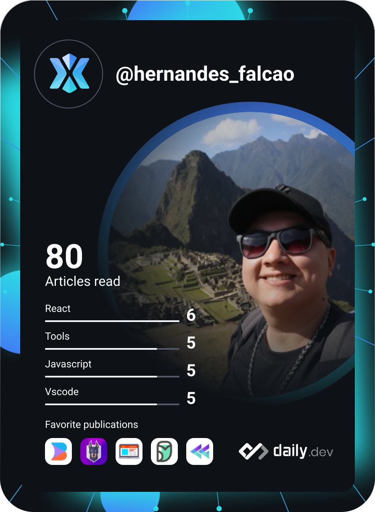

<!-- ═══════════════════════════════════════════════════════════════════ -->
<!--                  HERNANDES FALCÃO — GitHub Profile README          -->
<!-- ═══════════════════════════════════════════════════════════════════ -->


<div align="center">

[](https://git.io/typing-svg)

<br/>

[](https://linkedin.com/in/hernandes-falcao)
[](https://www.youtube.com/@falconcoding)
[](https://github.com/HernandesFalcao)
[](https://github.com/HernandesFalcao)

</div>

---

## `$ cat about.txt`

```yaml
name       : Hernandes Falcão
role       : Tech Lead @ Kruzer
pronouns   : he/him
location   : Brasil 🇧🇷
focus      :
  - Arquitetura de microsserviços em produção de alto volume
  - IA aplicada ao desenvolvimento de software
  - Decisões técnicas e de negócio em projetos enterprise
currently  :
  - Explorando microservices avançados + AI in production
  - Estudando padrões de resiliência e observabilidade
hobbies    : [ automação, artigos de tech, video-games ]
philosophy : "Código resolve dor real. Programação é o que me inspira."
```

---

## `$ cat now.md`

<table>
<tr>
<td>

🔭 **Building** — soluções enterprise de alto volume em Microsserviços  
🤖 **Learning** — AI in Production + LLM integrations  
✍️ **Sharing** — conteúdo técnico no YouTube  
💬 **Ask me about** — Node.js · Angular · Microservices · AI tooling  

</td>
</tr>
</table>

---

## `$ ls ./stack --all`

<div align="center">

**Frontend**

[](https://angular.io)
[](https://typescriptlang.org)
[](https://reactjs.org)
[](https://developer.mozilla.org/docs/Web/JavaScript)
[](https://redux.js.org)
[](https://developer.mozilla.org/docs/Web/HTML)
[](https://developer.mozilla.org/docs/Web/CSS)

**Backend**

[](https://nodejs.org)
[](https://expressjs.com)
[](https://mysql.com)
[](https://redis.io)
[](https://mongodb.com)

**DevOps & Cloud**

[](https://docker.com)
[](https://digitalocean.com)
[](https://git-scm.com)

</div>

---

## `$ cat stats.json`

<div align="center">

[](https://github.com/ryo-ma/github-profile-trophy)

<br/>

<a href="https://github.com/HernandesFalcao">
  
</a>
<a href="https://github.com/HernandesFalcao">
  
</a>

<br/>

[](https://git.io/streak-stats)

</div>

---

## `$ tail -f activity.log`

<div align="center">

[](https://github.com/ashutosh00710/github-readme-activity-graph)

<picture>
  <source media="(prefers-color-scheme: dark)" srcset="https://raw.githubusercontent.com/HernandesFalcao/HernandesFalcao/output/github-snake-dark.svg" />
  <source media="(prefers-color-scheme: light)" srcset="https://raw.githubusercontent.com/HernandesFalcao/HernandesFalcao/output/github-snake.svg" />
  
</picture>

</div>

---

## `$ cat devcard.svg`

<div align="center">
  <a href="https://app.daily.dev/HernandesFalcao">
    
  </a>
</div>

---

## `$ ls ./certifications`

```
📜  Lean Six Sigma White Belt
    └─ FM2S Educação e Consultoria · 2023
```

---

<div align="center">

```
╔══════════════════════════════════════════════════════════╗
║  "Desenvolver soluções e sanar a dor do cliente          ║
║   é o que me impulsiona."                                ║
╚══════════════════════════════════════════════════════════╝
```

</div>


